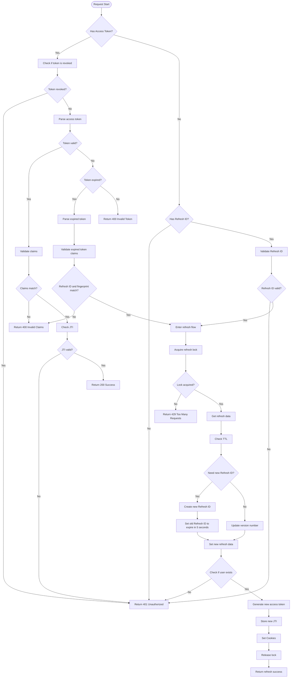

> [!Note]
> This content is translated by LLM. Original text can be found [here](README.zh.md)

# JWT Authentication
> A Golang JWT authentication library providing access and refresh tokens with fingerprint recognition, Redis storage, and automatic refresh functionality.

[](README.md) 
[](LICENSE)
[](https://github.com/pardnchiu/go-jwt/releases)
<br>
[](README.md)
[](README.zh.md) 

## Key Features

### Dual Token System
Access Token paired with Refresh ID, featuring an automatic refresh mechanism.

### Device Fingerprint Recognition
Generates a unique fingerprint based on `User-Agent`, `Device ID`, operating system, and browser to prevent token misuse across devices.

### Security Measures
Token revocation, version control, intelligent refresh, and concurrency protection using Redis locking.

## Flowchart

<details>
<summary>Click to view</summary>



</details>

## Dependencies

- [`github.com/gin-gonic/gin`](https://github.com/gin-gonic/gin)
- [`github.com/golang-jwt/jwt/v5`](https://github.com/golang-jwt/jwt/v5)
- [`github.com/redis/go-redis/v9`](https://github.com/redis/go-redis/v9)
- ~~[`github.com/pardnchiu/go-logger`](https://github.com/pardnchiu/go-logger)~~ (< v0.3.1)<br>
  Starting from `v0.3.1`, non-standard libraries are deprecated for performance and stability. Replaced with `log/slog`.

## Usage

### Installation
```bash
go get github.com/pardnchiu/go-jwt
```

### Initialization
```go
package main

import (
  "log"
  "net/http"
  
  "github.com/gin-gonic/gin"
  goJwt "github.com/pardnchiu/go-jwt"
)

func main() {
  config := goJwt.Config{
    Redis: goJwt.Redis{
      Host:     "localhost",
      Port:     6379,
      Password: "password",
      DB:       0,
    },
    CheckAuth: func(userData goJwt.Auth) (bool, error) {
      // Custom user validation logic
      return userData.ID != "", nil
    },
  }

  auth, err := goJwt.New(config)
  if err != nil {
    log.Fatal("Initialization failed:", err)
  }
  defer auth.Close()

  r := gin.Default()

  // Login endpoint
  r.POST("/login", func(c *gin.Context) {
    // After validating login credentials...
    user := &goJwt.Auth{
      ID:    "user123",
      Name:  "John Doe",
      Email: "john@example.com",
      Scope: []string{"read", "write"},
    }

    result := auth.Create(c.Writer, c.Request, user)
    if !result.Success {
      c.JSON(result.StatusCode, gin.H{"error": result.Error})
      return
    }

    c.JSON(http.StatusOK, gin.H{
      "success": true,
      "token":   result.Token.Token,
      "user":    result.Data,
    })
  })

  // Protected routes
  protected := r.Group("/api")
  protected.Use(auth.GinMiddleware())
  {
    protected.GET("/profile", func(c *gin.Context) {
      user, _ := goJwt.GetAuthDataFromGinContext(c)
      c.JSON(http.StatusOK, gin.H{"user": user})
    })
  }

  // Logout
  r.POST("/logout", func(c *gin.Context) {
    result := auth.Revoke(c.Writer, c.Request)
    if !result.Success {
      c.JSON(result.StatusCode, gin.H{"error": result.Error})
      return
    }
    c.JSON(http.StatusOK, gin.H{"message": "Logged out successfully"})
  })

  r.Run(":8080")
}
```

### Configuration
```go
type Config struct {
  Redis     Redis                    // Redis configuration (required)
  File      *File                    // File configuration for key management (optional)
  Option    *Option                  // System parameters and token settings (optional)
  Cookie    *Cookie                  // Cookie security settings (optional)
  CheckAuth func(Auth) (bool, error) // User authentication function (optional)
}

type Redis struct {
  Host     string // Redis server host address (required)
  Port     int    // Redis server port number (required)
  Password string // Redis authentication password (optional, empty string means no auth)
  DB       int    // Redis database index (required, usually 0-15)
}

type File struct {
  PrivateKeyPath string // ECDSA private key file path for JWT signing
  PublicKeyPath  string // ECDSA public key file path for JWT verification
}

type Option struct {
  PrivateKey           string        // ECDSA private key content (auto-generates P-256 if not provided)
  PublicKey            string        // ECDSA public key content (auto-generates P-256 if not provided)
  AccessTokenExpires   time.Duration // Access token expiration time (default: 15 minutes)
  RefreshIdExpires     time.Duration // Refresh ID expiration time (default: 7 days)
  AccessTokenCookieKey string        // Access token cookie name (default: "access_token")
  RefreshIdCookieKey   string        // Refresh ID cookie name (default: "refresh_id")
  MaxVersion           int           // Maximum version count for refresh tokens (default: 5)
  RefreshTTL           float64       // Refresh threshold as proportion of TTL (default: 0.5)
}

type Cookie struct {
  Domain   *string        // Cookie domain scope (nil means current domain)
  Path     *string        // Cookie path scope (default: "/")
  SameSite *http.SameSite // Cookie SameSite policy (default: Lax for CSRF prevention)
  Secure   *bool          // Cookie secure flag, HTTPS only (default: false)
  HttpOnly *bool          // Cookie HttpOnly flag for XSS prevention (default: true)
}
```

## Available Functions

### Instance Management

- `New()` - Create a new instance
  ```go
  auth, err := goJwt.New(config)
  ```
  - Initializes Redis connection
  - Auto-generates ECDSA keys if not provided
  - Validates configuration

- `Close()` - Close the instance
  ```go
  err := auth.Close()
  ```
  - Closes Redis connection
  - Releases system resources

### JWT Management

- `Create()` - Generate a new JWT
  ```go
  result := auth.Create(w, r, userData)
  ```
  - Generates access token and refresh ID
  - Sets secure cookies
  - Stores session data in Redis

- `Verify()` - Verify JWT
  ```go
  result := auth.Verify(w, r)
  ```
  - Parses and validates JWT token
  - Checks device fingerprint
  - Automatically refreshes if needed
  - Returns user data

- `Revoke()` - Terminate JWT
  ```go
  result := auth.Revoke(w, r)
  ```
  - Clears cookies
  - Adds token to blacklist
  - Updates Redis records

### Middleware

```go
// Gin framework middleware
protected.Use(auth.GinMiddleware())

// Standard HTTP middleware
server := &http.Server{
  Handler: auth.HTTPMiddleware(handler),
}

// Get user data from context
user, exists := goJwt.GetAuthDataFromGinContext(c)
user, exists := goJwt.GetAuthDataFromHTTPRequest(r)
```

### Supports Multiple Authentication Methods

#### Custom Headers
```
r.Header.Set("X-Device-FP", fingerprint)
r.Header.Set("X-Refresh-ID", refreshID)
r.Header.Set("Authorization", "Bearer "+token)
```

#### Automatic Cookie Management
```
access_token, refresh_id cookies
```

## Error Handling
> All methods return a [`JWTAuthResult`](type.go) structure
```go
type JWTAuthResult struct {
  StatusCode int          // HTTP status code
  Success    bool         // Whether operation succeeded
  Data       *Auth        // User data
  Token      *TokenResult // Token information
  Error      string       // Error message
  ErrorTag   string       // Error category tag
}
```

### Error Tags
- `data_missing` - Missing required data
- `data_invalid` - Invalid data format
- `unauthorized` - Authentication failed
- `revoked` - Token revoked
- `failed_to_update` - Update operation failed
- `failed_to_create` - Creation operation failed
- `failed_to_sign` - Token signing failed
- `failed_to_store` - Storage operation failed
- `failed_to_get` - Retrieval operation failed

## License

This project is licensed under the [MIT](LICENSE) license.

## Author


<h4 style="padding-top: 0">邱敬幃 Pardn Chiu</h4>

<a href="mailto:dev@pardn.io" target="_blank">
  
</a> <a href="https://linkedin.com/in/pardnchiu" target="_blank">
  
</a>

***

©️ 2025 [邱敬幃 Pardn Chiu](https://pardn.io)
