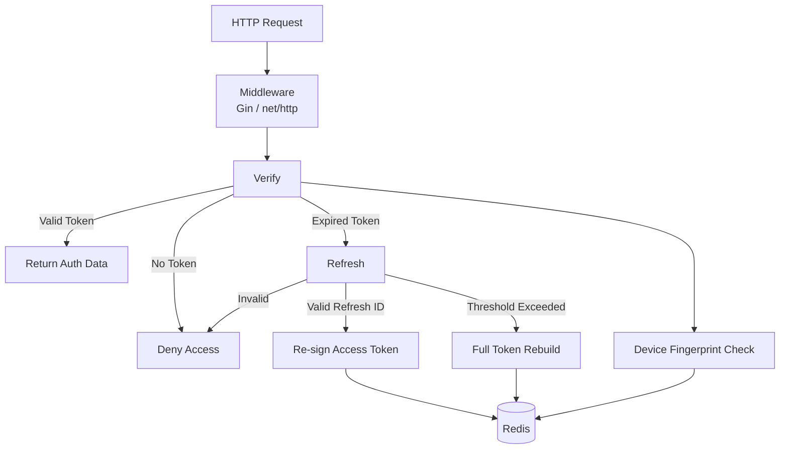

> [!NOTE]
> This README was generated by [SKILL](https://github.com/pardnchiu/skill-readme-generate), get the ZH version from [here](./README.zh.md).

# go-jwt

[](https://pkg.go.dev/github.com/pardnchiu/go-jwt)
[](https://goreportcard.com/report/github.com/pardnchiu/go-jwt)
[](https://app.codecov.io/github/pardnchiu/go-jwt)
[](LICENSE)
[](https://github.com/pardnchiu/go-jwt/releases)
[](https://github.com/avelino/awesome-go)

> ECDSA and Redis-backed JWT authentication library with full token lifecycle management and device fingerprint binding.

## Table of Contents

- [Features](#features)
- [Architecture](#architecture)
- [File Structure](#file-structure)
- [License](#license)
- [Author](#author)
- [Stars](#stars)

## Features

> `go get github.com/pardnchiu/go-jwt` · [Documentation](./doc.md)

### Redis-Driven Token Lifecycle

Integrates Redis for complete Access Token and Refresh ID lifecycle management, including creation, verification, refresh, and revocation. Ensures atomicity of multi-key operations through Redis Transaction Pipelines and prevents concurrent Refresh Token race conditions with distributed locks.

### Device Fingerprint Binding

Binds tokens to the user's device environment (OS, browser, device type) via SHA-256 hashing. Even if a token is stolen, attackers cannot use it on a different device, fundamentally preventing token hijacking attacks.

### Dual-Framework Middleware

Provides plug-and-play middleware for both Gin and standard `net/http`, automatically handling token verification and expiration refresh flows. Developers retrieve authenticated user data directly from the context without manual token lifecycle intervention.

## Architecture


```mermaid
graph TB
    REQ[HTTP Request] --> MW[Middleware<br/>Gin / net/http]
    MW --> V[Verify]
    V -->|Valid Token| AUTH[Return Auth Data]
    V -->|Expired Token| RF[Refresh]
    V -->|No Token| DENY[Deny Access]
    RF -->|Valid Refresh ID| SIGN[Re-sign Access Token]
    RF -->|Threshold Exceeded| CREATE[Full Token Rebuild]
    RF -->|Invalid| DENY
    SIGN --> REDIS[(Redis)]
    CREATE --> REDIS
    V --> FP[Device Fingerprint Check]
    FP --> REDIS
```

## File Structure

```
go-jwt/
├── instance.go       # Initialization and config validation
├── create.go         # Token creation and JWT signing
├── verify.go         # Token verification and JWT parsing
├── refresh.go        # Token refresh with distributed lock
├── revoke.go         # Token revocation
├── middleware.go     # Gin / net/http middleware
├── cookie.go         # Cookie management
├── pem.go            # ECDSA key handling
├── refreshData.go    # Refresh ID and device fingerprint
├── utility.go        # Helper functions
├── uuid.go           # UUID v4 generation
├── type.go           # Type definitions
├── jwt_test.go       # Unit tests
└── go.mod
```

## License

This project is licensed under the [MIT LICENSE](LICENSE).

## Author


<h4 style="padding-top: 0">邱敬幃 Pardn Chiu</h4>

<a href="mailto:dev@pardn.io" target="_blank">

</a> <a href="https://linkedin.com/in/pardnchiu" target="_blank">

</a>

## Stars

[](https://www.star-history.com/#pardnchiu/go-jwt&Date)

***

©️ 2025 [邱敬幃 Pardn Chiu](https://linkedin.com/in/pardnchiu)
