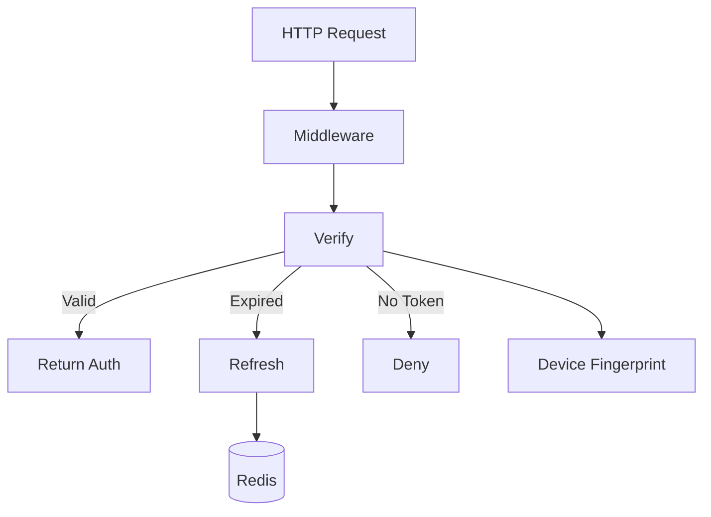

> [!NOTE]
> This README was generated by [SKILL](https://github.com/agenvoy/skill-readme-generate), get the ZH version from [here](./doc/README.zh.md).

***

<p align="center">
<strong>ECDSA JWT WITH REDIS LIFECYCLE AND DEVICE BINDING</strong>
</p>

<p align="center">
<a href="https://pkg.go.dev/github.com/pardnchiu/go-jwt"></a>
<a href="https://github.com/pardnchiu/go-jwt/releases"></a>
<a href="LICENSE"></a>
<a href="https://app.codecov.io/github/pardnchiu/go-jwt/tree/master"></a>
</p>

***

> A Go JWT library with Redis lifecycle, device fingerprint binding, and dual middleware

## Table of Contents

- [Features](#features)
- [Architecture](#architecture)
- [License](#license)
- [Author](#author)

## Features

> `go get github.com/pardnchiu/go-jwt` · [Documentation](./doc/doc.md)

```go
import "github.com/pardnchiu/go-jwt/core"
```

- **Redis Token Lifecycle** — Manage create, verify, refresh, and revoke for Access Token and Refresh ID with Transaction Pipelines and distributed locks.
- **Device Fingerprint Binding** — Bind tokens to OS, browser, and device ID via SHA-256 so stolen tokens fail on other devices.
- **Dual-Framework Middleware** — Drop-in Gin and net/http middleware that verifies tokens and refreshes them transparently on expiry.
- **ES256 with Auto PEM** — Sign with ECDSA P-256; load keys from path, inline PEM, or auto-generate a key pair on first run.
- **Versioned Transparent Refresh** — Rebuild only the Access Token or fully rotate Refresh ID based on MaxVersion and TTL thresholds.

## Architecture

> [Full Architecture](./doc/architecture.md)


```mermaid
graph TB
    REQ[HTTP Request] --> MW[Middleware]
    MW --> V[Verify]
    V -->|Valid| AUTH[Return Auth]
    V -->|Expired| RF[Refresh]
    V -->|No Token| DENY[Deny]
    RF --> REDIS[(Redis)]
    V --> FP[Device Fingerprint]
```

## License

This project is licensed under the [MIT LICENSE](LICENSE).

## Author


<h4 style="padding-top: 0">邱敬幃 Pardn Chiu</h4>

<a href="mailto:hi@pardn.io">hi@pardn.io</a><br>
<a href="https://www.linkedin.com/in/pardnchiu">https://www.linkedin.com/in/pardnchiu</a>

***

©️ 2025 [邱敬幃 Pardn Chiu](https://www.linkedin.com/in/pardnchiu)
