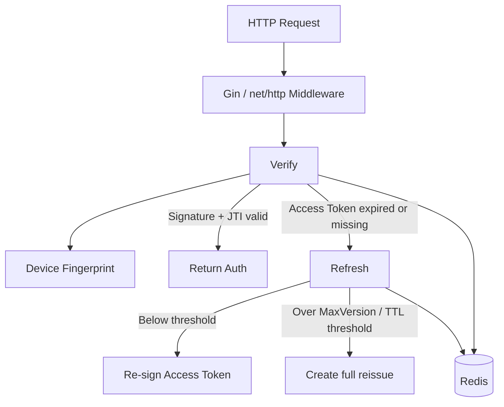

> [!NOTE]
> This README was generated by [SKILL](https://github.com/agenvoy/skill-readme-generate), get the ZH version from [here](./doc/README.zh.md).

***

<strong>ECDSA JWT WITH REDIS LIFECYCLE AND DEVICE BINDING</strong>

 

***

> A Go JWT library with Redis token lifecycle, device fingerprint binding, and lock-guarded transparent refresh

## Table of Contents

- [Features](#features)
- [Architecture](#architecture)
- [License](#license)
- [Author](#author)

## Features

> `go get github.com/pardnchiu/go-jwt@latest` · import path `github.com/pardnchiu/go-jwt/core` · [Documentation](./doc/doc.md)

- **Redis-Controlled Token Lifecycle** — An Access Token must pass both the ES256 signature and a Redis JTI whitelist, so logout writes a revocation record that takes effect immediately instead of waiting for JWT expiry.
- **Device Fingerprint Binding** — A SHA-256 fingerprint of OS, browser, device type, and device ID binds both the Access Token and Refresh ID, so a stolen token fails on any other device.
- **Lock-Guarded Transparent Refresh** — Expired tokens are re-signed from the Refresh ID automatically, and a `SETNX` lock with Lua compare-and-delete unlock ensures one refresh per Refresh ID across instances.
- **Versioned Refresh ID Rotation** — The full token pair is reissued once refreshes exceed `MaxVersion` or the remaining TTL drops below a threshold; otherwise only the Access Token is re-signed to keep Redis writes low.
- **ES256 Auto Keys with Dual Middleware** — Keys load from file paths or inline PEM, or a P-256 key pair is generated on first start, with drop-in Gin and `net/http` middleware.

## Architecture

> [Full Architecture](./doc/architecture.md)

```mermaid
graph TB
    REQ[HTTP Request] --> MW[Gin / net/http Middleware]
    MW --> V[Verify]
    V --> FP[Device Fingerprint]
    V -->|Signature + JTI valid| OK[Return Auth]
    V -->|Access Token expired or missing| RF[Refresh]
    RF -->|Below threshold| RS[Re-sign Access Token]
    RF -->|Over MaxVersion / TTL threshold| CR[Create full reissue]
    V --> REDIS[(Redis)]
    RF --> REDIS
```

## License

This project is licensed under the [MIT LICENSE](LICENSE).

## Author

Just [open an issue](https://github.com/pardnchiu/go-jwt/issues/new) to share an idea.

***

©️ 2025 [邱敬幃 Pardn Chiu](https://www.linkedin.com/in/pardnchiu)
