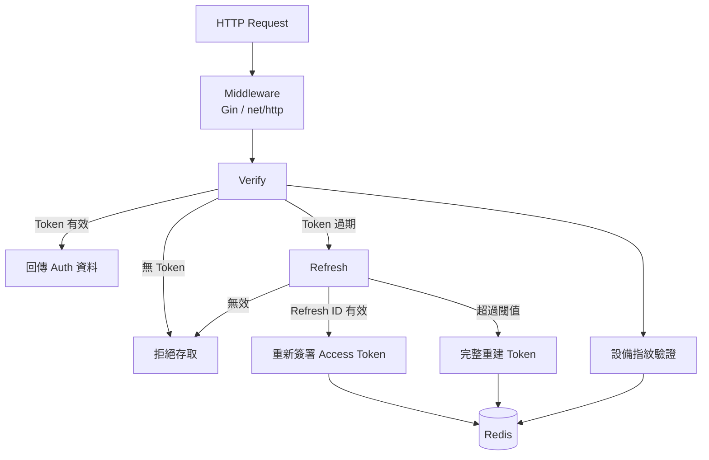

> [!NOTE]
> 此 README 由 [SKILL](https://github.com/pardnchiu/skill-readme-generate) 生成，英文版請參閱 [這裡](./README.md)。

# go-jwt

[](https://pkg.go.dev/github.com/pardnchiu/go-jwt)
[](https://goreportcard.com/report/github.com/pardnchiu/go-jwt)
[](https://app.codecov.io/github/pardnchiu/go-jwt)
[](LICENSE)
[](https://github.com/pardnchiu/go-jwt/releases)
[](https://github.com/avelino/awesome-go)

> 基於 ECDSA 與 Redis 的 JWT 認證函式庫，提供完整的 Token 生命週期管理與設備指紋綁定。

## 目錄

- [功能特點](#功能特點)
- [架構](#架構)
- [檔案結構](#檔案結構)
- [授權](#授權)
- [Author](#author)
- [Stars](#stars)

## 功能特點

> `go get github.com/pardnchiu/go-jwt` · [完整文件](./doc.zh.md)

### Redis 驅動的 Token 生命週期

整合 Redis 實現 Access Token 與 Refresh ID 的完整生命週期管理，包含建立、驗證、刷新與撤銷。透過 Redis Transaction Pipeline 確保多鍵操作的原子性，並以分散式鎖防止 Refresh Token 的並發競爭問題。

### 設備指紋綁定

將 Token 與使用者的設備環境（作業系統、瀏覽器、裝置類型）進行 SHA-256 雜湊綁定。即使 Token 被竊取，攻擊者也無法在不同設備上使用，從根本上防止 Token 劫持攻擊。

### 雙框架 Middleware 支援

同時提供 Gin 與標準 `net/http` 的即插即用 Middleware，自動處理 Token 驗證與過期刷新流程。開發者無需手動介入 Token 生命週期，只需透過 Context 取得已驗證的使用者資料。

## 架構


```mermaid
graph TB
    REQ[HTTP Request] --> MW[Middleware<br/>Gin / net/http]
    MW --> V[Verify]
    V -->|Token 有效| AUTH[回傳 Auth 資料]
    V -->|Token 過期| RF[Refresh]
    V -->|無 Token| DENY[拒絕存取]
    RF -->|Refresh ID 有效| SIGN[重新簽署 Access Token]
    RF -->|超過閾值| CREATE[完整重建 Token]
    RF -->|無效| DENY
    SIGN --> REDIS[(Redis)]
    CREATE --> REDIS
    V --> FP[設備指紋驗證]
    FP --> REDIS
```

## 檔案結構

```
go-jwt/
├── instance.go       # 初始化與設定驗證
├── create.go         # Token 建立與 JWT 簽署
├── verify.go         # Token 驗證與 JWT 解析
├── refresh.go        # Token 刷新與分散式鎖
├── revoke.go         # Token 撤銷
├── middleware.go     # Gin / net/http Middleware
├── cookie.go         # Cookie 管理
├── pem.go            # ECDSA 金鑰處理
├── refreshData.go    # Refresh ID 與設備指紋
├── utility.go        # 輔助函式
├── uuid.go           # UUID v4 生成
├── type.go           # 型別定義
├── jwt_test.go       # 單元測試
└── go.mod
```

## 授權

本專案採用 [MIT LICENSE](LICENSE)。

## Author


<h4 style="padding-top: 0">邱敬幃 Pardn Chiu</h4>

<a href="mailto:dev@pardn.io" target="_blank">

</a> <a href="https://linkedin.com/in/pardnchiu" target="_blank">

</a>

## Stars

[](https://www.star-history.com/#pardnchiu/go-jwt&Date)

***

©️ 2025 [邱敬幃 Pardn Chiu](https://linkedin.com/in/pardnchiu)
