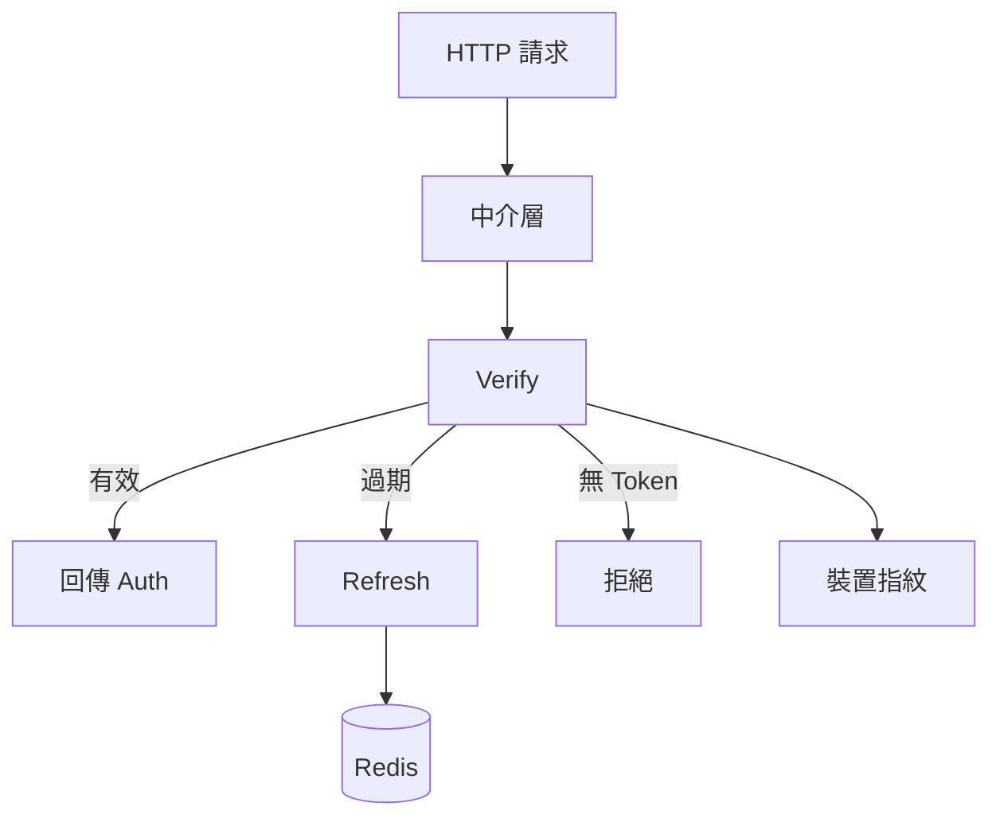

> [!NOTE]
> 此 README 由 [SKILL](https://github.com/agenvoy/skill-readme-generate) 生成，英文版請參閱 [這裡](../README.md)。

***

<p align="center">
<strong>ECDSA JWT WITH REDIS LIFECYCLE AND DEVICE BINDING</strong>
</p>

<p align="center">
<a href="https://pkg.go.dev/github.com/pardnchiu/go-jwt"></a>
<a href="https://github.com/pardnchiu/go-jwt/releases"></a>
<a href="LICENSE"></a>
<a href="https://app.codecov.io/github/pardnchiu/go-jwt/tree/develop"></a><br>
<a href="https://github.com/avelino/awesome-go"></a>
</p>

***

> Go JWT 函式庫，具備 Redis 生命週期、裝置指紋綁定與雙框架中介層

## 目錄

- [功能特點](#功能特點)
- [架構](#架構)
- [授權](#授權)
- [Author](#author)

## 功能特點

> `go get github.com/pardnchiu/go-jwt` · [完整文件](./doc.zh.md)

```go
import "github.com/pardnchiu/go-jwt/core"
```

- **Redis Token 生命週期** — 以 Transaction Pipeline 與分散鎖管理 Access Token 與 Refresh ID 的建立、驗證、刷新與撤銷。
- **裝置指紋綁定** — 以 SHA-256 綁定 OS、瀏覽器與裝置 ID，Token 被竊後無法在其他裝置使用。
- **雙框架中介層** — 提供 Gin 與 net/http 即插即用中介層，過期時透明刷新並從 context 取用使用者資料。
- **ES256 自動 PEM** — 以 ECDSA P-256 簽署；可從路徑、內嵌 PEM 載入，或首次執行自動產生金鑰對。
- **版本化透明刷新** — 依 MaxVersion 與 TTL 門檻僅重建 Access Token 或完整輪換 Refresh ID。

## 架構

> [完整架構](./architecture.zh.md)



## 授權

本專案採用 [MIT LICENSE](../LICENSE)。

## Author


<h4 style="padding-top: 0">邱敬幃 Pardn Chiu</h4>

<a href="mailto:hi@pardn.io">hi@pardn.io</a><br>
<a href="https://www.linkedin.com/in/pardnchiu">https://www.linkedin.com/in/pardnchiu</a>

***

©️ 2025 [邱敬幃 Pardn Chiu](https://www.linkedin.com/in/pardnchiu)
