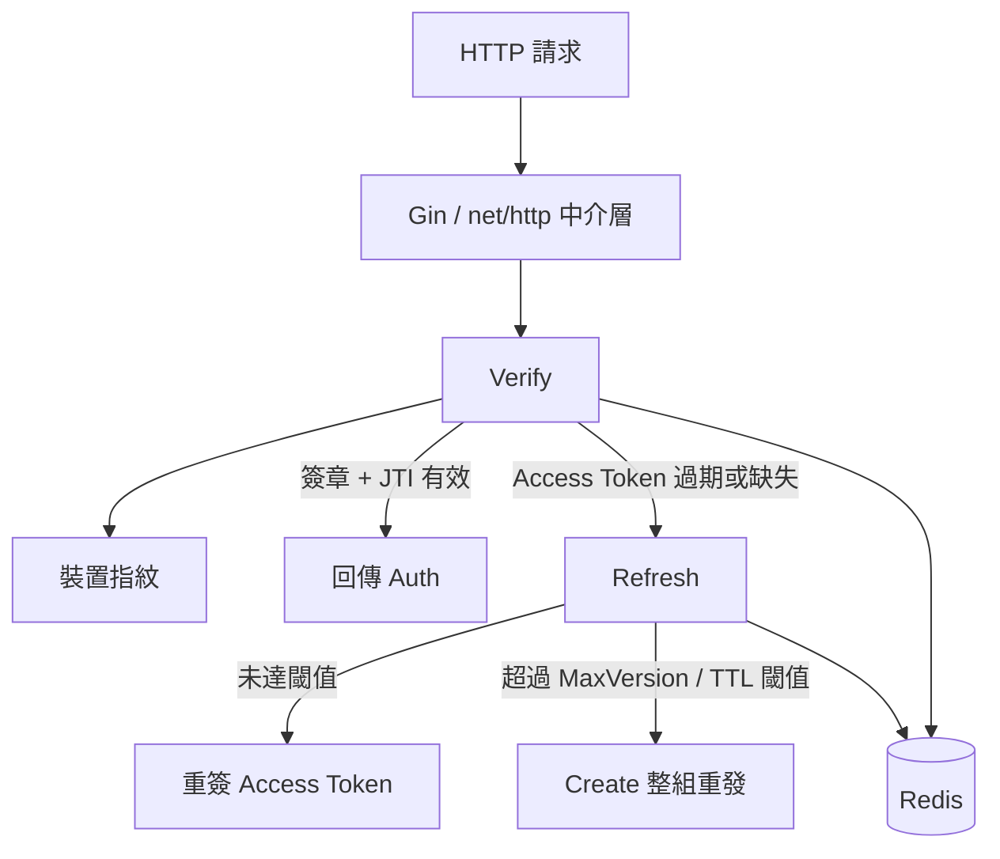

> [!NOTE]
> 此 README 由 [SKILL](https://github.com/agenvoy/skill-readme-generate) 生成，英文版請參閱 [這裡](../README.md)。

***

<strong>ECDSA JWT WITH REDIS LIFECYCLE AND DEVICE BINDING</strong>

 

***

> Go JWT 函式庫，具備 Redis Token 生命週期、裝置指紋綁定與分散鎖透明刷新

## 目錄

- [功能特點](#功能特點)
- [架構](#架構)
- [授權](#授權)
- [Author](#author)

## 功能特點

> `go get github.com/pardnchiu/go-jwt@latest` · 匯入路徑 `github.com/pardnchiu/go-jwt/core` · [完整文件](./doc.zh.md)

- **Redis 管控 Token 生命週期** — Access Token 須同時通過 ES256 簽章與 Redis JTI 白名單，登出寫入撤銷紀錄即刻失效，不必等 JWT 自然過期。
- **裝置指紋綁定** — 以 OS、瀏覽器、裝置類型與裝置 ID 的 SHA-256 指紋綁定 Token 與 Refresh ID，被竊的 Token 換裝置即驗證失敗。
- **分散鎖透明刷新** — 過期時自動以 Refresh ID 重簽，`SETNX` 鎖加 Lua 比對解鎖確保多實例下同一 Refresh ID 只被刷新一次。
- **版本化 Refresh ID 輪替** — 刷新次數超過 `MaxVersion` 或剩餘 TTL 低於閾值時整組重發，平時只重簽 Access Token 以降低 Redis 寫入。
- **ES256 自動金鑰與雙框架中介層** — 金鑰可從路徑、內嵌 PEM 載入或首次啟動自動產生 P-256 金鑰對，並提供 Gin 與 `net/http` 即插即用中介層。

## 架構

> [完整架構](./architecture.zh.md)

```mermaid
graph TB
    REQ[HTTP 請求] --> MW[Gin / net/http 中介層]
    MW --> V[Verify]
    V --> FP[裝置指紋]
    V -->|簽章 + JTI 有效| OK[回傳 Auth]
    V -->|Access Token 過期或缺失| RF[Refresh]
    RF -->|未達閾值| RS[重簽 Access Token]
    RF -->|超過 MaxVersion / TTL 閾值| CR[Create 整組重發]
    V --> REDIS[(Redis)]
    RF --> REDIS
```

## 授權

本專案採用 [MIT LICENSE](../LICENSE)。

## Author

Just [open an issue](https://github.com/pardnchiu/go-jwt/issues/new) to share an idea.

***

©️ 2025 [邱敬幃 Pardn Chiu](https://www.linkedin.com/in/pardnchiu)
