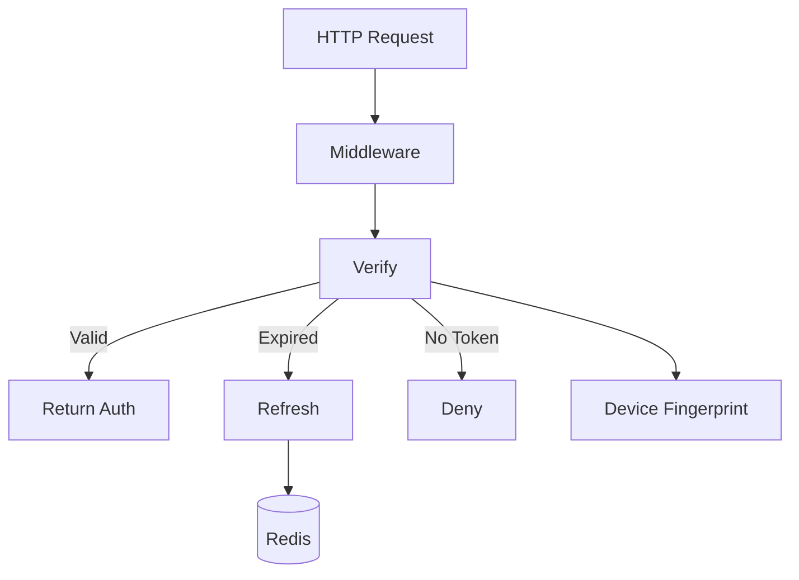
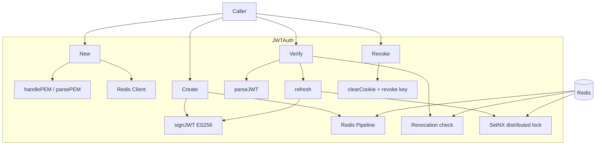
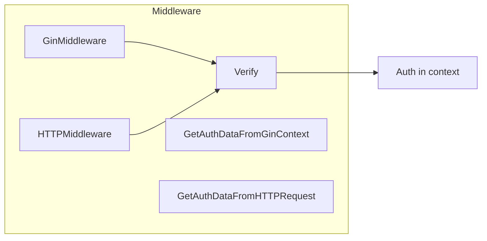
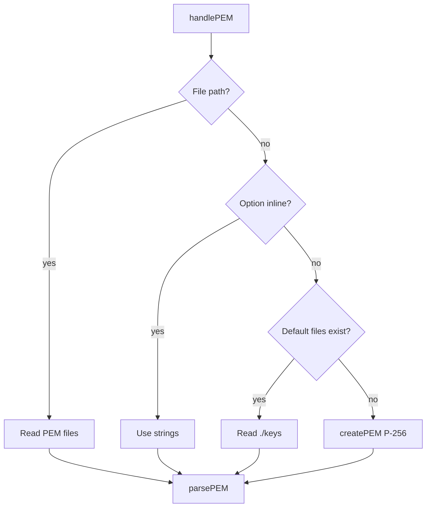
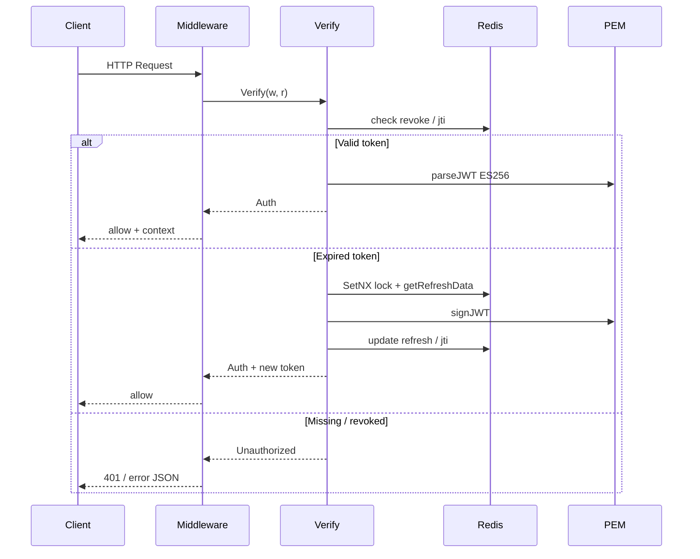

# go-jwt - Architecture

> Back to [README](../README.md)

## Overview

## Module: JWTAuth

`JWTAuth` is the public entry point holding Config, Redis client, and ECDSA keys.

## Module: Middleware

Gin and net/http middleware wrap `Verify` and store `Auth` in context on success.

## Module: PEM

Key load order: file path → inline PEM string → default path auto-generate ECDSA P-256.

## Data Flow

***

©️ 2025 [邱敬幃 Pardn Chiu](https://www.linkedin.com/in/pardnchiu)
