# go-jwt - Architecture

> Back to [README](../README.md)

## Overview

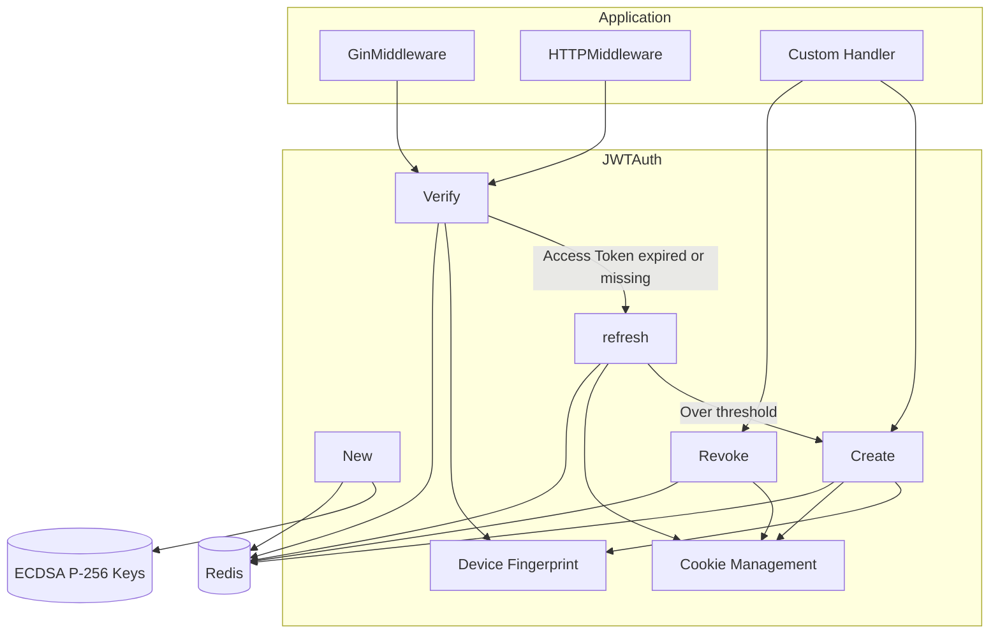
```mermaid
graph TB
    subgraph Application
        GIN[GinMiddleware]
        HTTP[HTTPMiddleware]
        APP[Custom Handler]
    end

    subgraph JWTAuth
        NEW[New]
        CREATE[Create]
        VERIFY[Verify]
        REFRESH[refresh]
        REVOKE[Revoke]
        FP[Device Fingerprint]
        COOKIE[Cookie Management]
    end

    GIN --> VERIFY
    HTTP --> VERIFY
    APP --> CREATE
    APP --> REVOKE
    VERIFY -->|Access Token expired or missing| REFRESH
    REFRESH -->|Over threshold| CREATE
    CREATE --> FP
    VERIFY --> FP
    CREATE --> COOKIE
    REFRESH --> COOKIE
    REVOKE --> COOKIE

    NEW --> PEM[(ECDSA P-256 Keys)]
    NEW --> REDIS[(Redis)]
    CREATE --> REDIS
    VERIFY --> REDIS
    REFRESH --> REDIS
    REVOKE --> REDIS
```

## Module: Initialization (New)

Applies default options, loads or generates ECDSA keys, and sets up the Redis connection and logger.

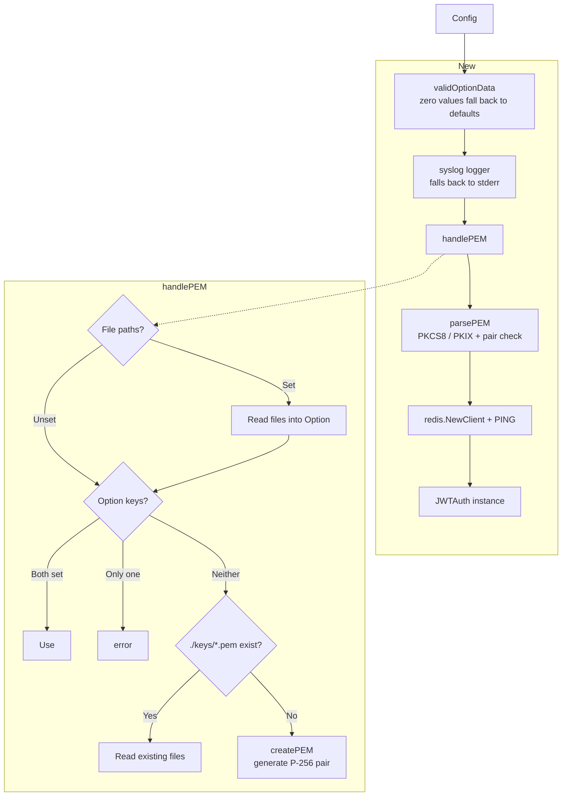
```mermaid
graph TB
    subgraph New
        OPT[validOptionData<br>zero values fall back to defaults] --> LOG[syslog logger<br>falls back to stderr]
        LOG --> HP[handlePEM]
        HP --> PP["parsePEM<br>PKCS8 / PKIX + pair check"]
        PP --> RC[redis.NewClient + PING]
        RC --> INST[JWTAuth instance]
    end

    subgraph handlePEM
        F{File paths?} -->|Set| RF[Read files into Option]
        F -->|Unset| O{Option keys?}
        RF --> O
        O -->|Both set| DONE[Use]
        O -->|Only one| ERR[error]
        O -->|Neither| D{./keys/*.pem exist?}
        D -->|Yes| RD[Read existing files]
        D -->|No| GEN[createPEM<br>generate P-256 pair]
    end

    CFG[Config] --> OPT
    HP -.-> F
```

## Module: Issuance (Create)

Generates a JTI, Refresh ID, and ES256 Access Token for the user, then writes Redis in a single transaction.

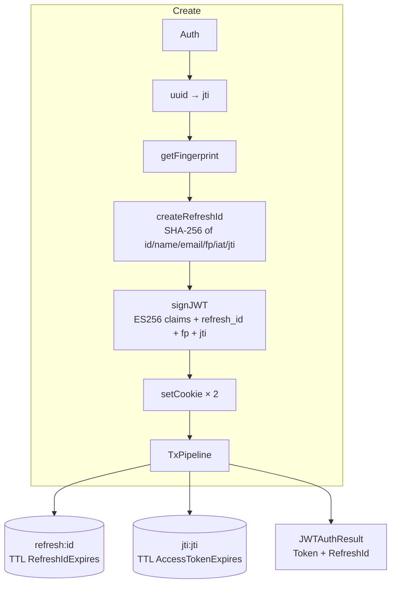
```mermaid
graph TB
    subgraph Create
        IN[Auth] --> JTI[uuid → jti]
        JTI --> FPC[getFingerprint]
        FPC --> RID[createRefreshId<br>SHA-256 of id/name/email/fp/iat/jti]
        RID --> SIGN[signJWT<br>ES256 claims + refresh_id + fp + jti]
        SIGN --> CK[setCookie × 2]
        CK --> TX[TxPipeline]
    end

    TX --> K1[(refresh:id<br>TTL RefreshIdExpires)]
    TX --> K2[(jti:jti<br>TTL AccessTokenExpires)]
    TX --> OUT[JWTAuthResult<br>Token + RefreshId]
```

## Module: Verification (Verify)

Checks the revocation record, signature and timing, Refresh ID binding, fingerprint, and JTI whitelist in order.

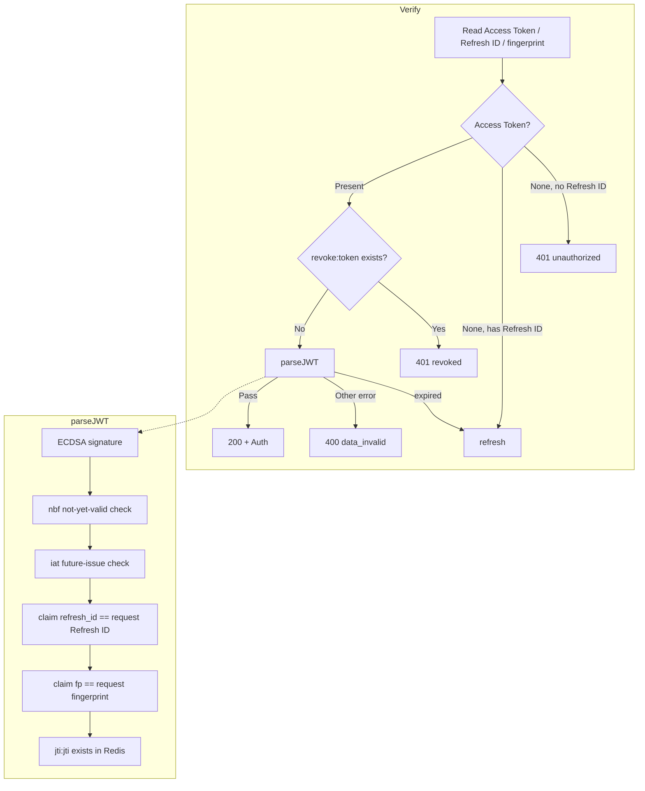
```mermaid
graph TB
    subgraph Verify
        GET[Read Access Token / Refresh ID / fingerprint] --> A{Access Token?}
        A -->|None, no Refresh ID| U401[401 unauthorized]
        A -->|None, has Refresh ID| RF[refresh]
        A -->|Present| RV{revoke:token exists?}
        RV -->|Yes| R401[401 revoked]
        RV -->|No| PJ[parseJWT]
        PJ -->|expired| RF
        PJ -->|Other error| I400[400 data_invalid]
        PJ -->|Pass| OK[200 + Auth]
    end

    subgraph parseJWT
        S[ECDSA signature] --> NBF[nbf not-yet-valid check]
        NBF --> IAT[iat future-issue check]
        IAT --> RIDM[claim refresh_id == request Refresh ID]
        RIDM --> FPM[claim fp == request fingerprint]
        FPM --> JT[jti:jti exists in Redis]
    end

    PJ -.-> S
```

## Module: Refresh (refresh)

Loads refresh data by Refresh ID and, under a distributed lock, either re-signs only the Access Token or reissues the full pair.

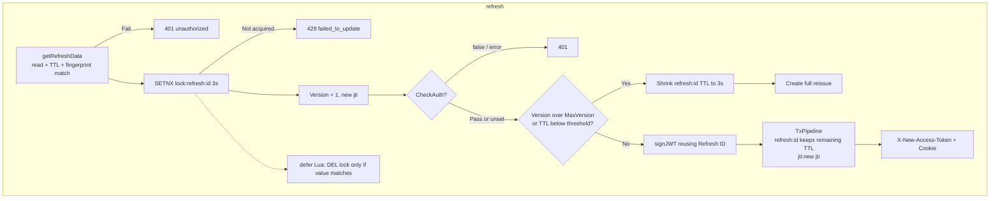
```mermaid
graph TB
    subgraph refresh
        GRD[getRefreshData<br>read + TTL + fingerprint match] -->|Fail| E401[401 unauthorized]
        GRD --> LOCK[SETNX lock:refresh:id 3s]
        LOCK -->|Not acquired| E429[429 failed_to_update]
        LOCK --> VER[Version + 1, new jti]
        VER --> CA{CheckAuth?}
        CA -->|false / error| C401[401]
        CA -->|Pass or unset| TH{"Version over MaxVersion<br>or TTL below threshold?"}
        TH -->|Yes| SHORT[Shrink refresh:id TTL to 3s] --> CR[Create full reissue]
        TH -->|No| RS[signJWT reusing Refresh ID]
        RS --> TX[TxPipeline<br>refresh:id keeps remaining TTL<br>jti:new jti]
        TX --> HDR[X-New-Access-Token + Cookie]
        UNLOCK[defer Lua: DEL lock only if value matches]
    end

    LOCK -.-> UNLOCK
```

## Module: Revocation (Revoke)

Clears cookies, records the Access Token as revoked, and expires the Refresh ID after 5 seconds.

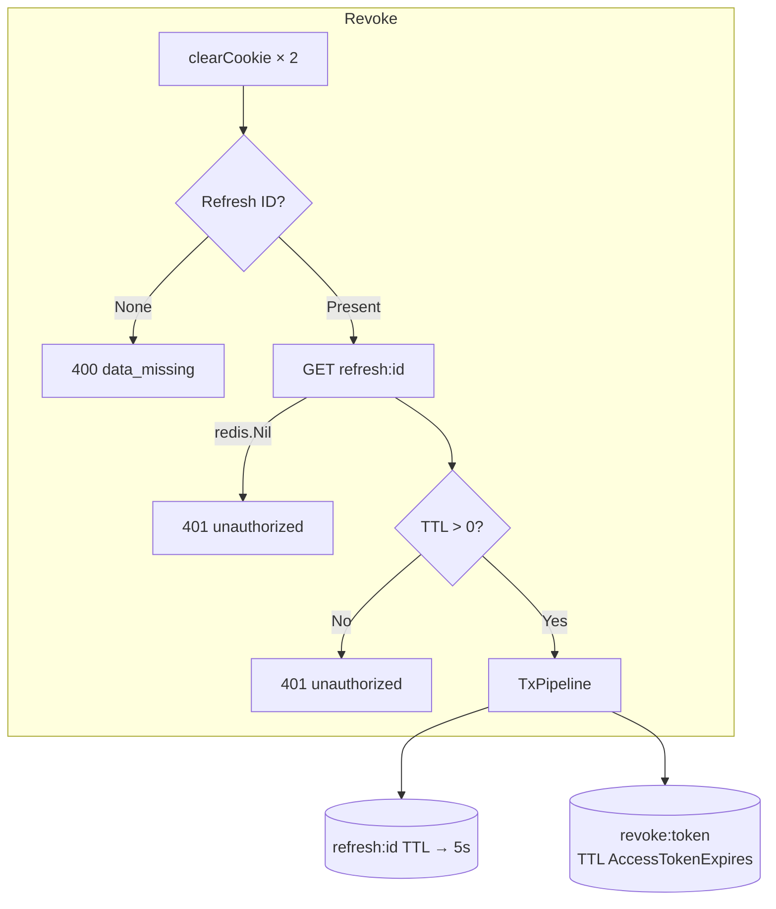
```mermaid
graph TB
    subgraph Revoke
        CC[clearCookie × 2] --> RID{Refresh ID?}
        RID -->|None| E400[400 data_missing]
        RID -->|Present| G[GET refresh:id]
        G -->|redis.Nil| E401[401 unauthorized]
        G --> TTL{TTL > 0?}
        TTL -->|No| X401[401 unauthorized]
        TTL -->|Yes| TX[TxPipeline]
    end

    TX --> K1[(refresh:id TTL → 5s)]
    TX --> K2[(revoke:token<br>TTL AccessTokenExpires)]
```

## Module: Device Fingerprint

Derives a SHA-256 fingerprint from the User-Agent and device ID; `X-Device-FP` overrides it directly.

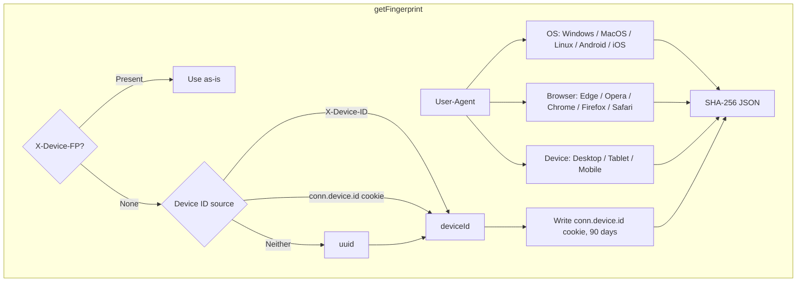
```mermaid
graph TB
    subgraph getFingerprint
        H{X-Device-FP?} -->|Present| RET[Use as-is]
        H -->|None| DID{Device ID source}
        DID -->|X-Device-ID| D[deviceId]
        DID -->|conn.device.id cookie| D
        DID -->|Neither| NEW[uuid]
        NEW --> D
        D --> SC[Write conn.device.id cookie, 90 days]
        UA[User-Agent] --> OS[OS: Windows / MacOS / Linux / Android / iOS]
        UA --> BR[Browser: Edge / Opera / Chrome / Firefox / Safari]
        UA --> DEV[Device: Desktop / Tablet / Mobile]
        OS --> HASH[SHA-256 JSON]
        BR --> HASH
        DEV --> HASH
        SC --> HASH
    end
```

When the User-Agent matches no known OS or browser, that component becomes a per-request random UUID and the fingerprint is unstable; non-browser clients should send `X-Device-FP`.

## Module: Middleware

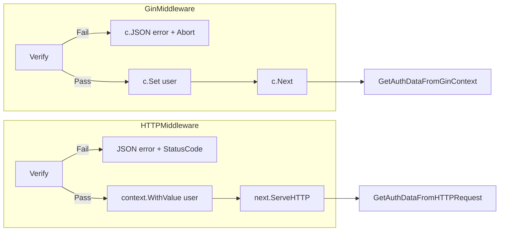
```mermaid
graph LR
    subgraph GinMiddleware
        GV[Verify] -->|Fail| GA[c.JSON error + Abort]
        GV -->|Pass| GS[c.Set user] --> GN[c.Next]
    end

    subgraph HTTPMiddleware
        HV[Verify] -->|Fail| HE[JSON error + StatusCode]
        HV -->|Pass| HC[context.WithValue user] --> HN[next.ServeHTTP]
    end

    GN --> GG[GetAuthDataFromGinContext]
    HN --> HG[GetAuthDataFromHTTPRequest]
```

## Type Relationships

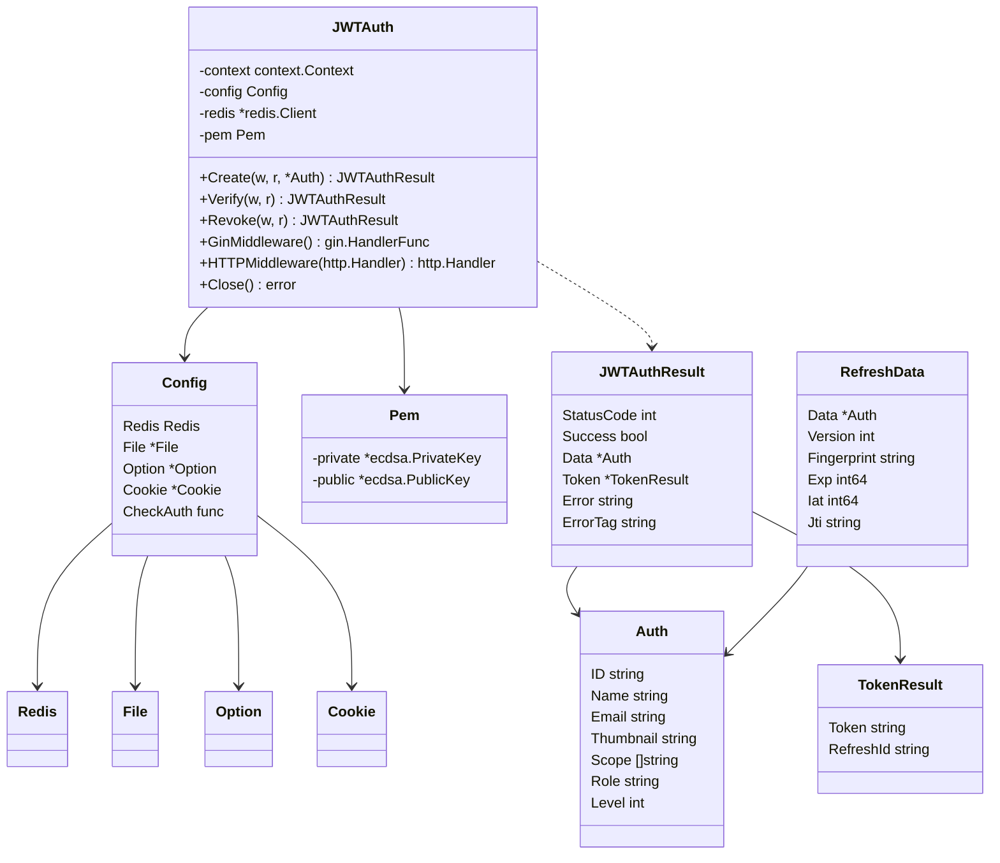
```mermaid
classDiagram
    class Config {
        Redis Redis
        File *File
        Option *Option
        Cookie *Cookie
        CheckAuth func
    }
    class JWTAuth {
        -context context.Context
        -config Config
        -redis *redis.Client
        -pem Pem
        +Create(w, r, *Auth) JWTAuthResult
        +Verify(w, r) JWTAuthResult
        +Revoke(w, r) JWTAuthResult
        +GinMiddleware() gin.HandlerFunc
        +HTTPMiddleware(http.Handler) http.Handler
        +Close() error
    }
    class Pem {
        -private *ecdsa.PrivateKey
        -public *ecdsa.PublicKey
    }
    class JWTAuthResult {
        StatusCode int
        Success bool
        Data *Auth
        Token *TokenResult
        Error string
        ErrorTag string
    }
    class TokenResult {
        Token string
        RefreshId string
    }
    class RefreshData {
        Data *Auth
        Version int
        Fingerprint string
        Exp int64
        Iat int64
        Jti string
    }
    class Auth {
        ID string
        Name string
        Email string
        Thumbnail string
        Scope []string
        Role string
        Level int
    }

    JWTAuth --> Config
    JWTAuth --> Pem
    Config --> Redis
    Config --> File
    Config --> Option
    Config --> Cookie
    JWTAuth ..> JWTAuthResult
    JWTAuthResult --> Auth
    JWTAuthResult --> TokenResult
    RefreshData --> Auth
```

## Data Flow

### Login

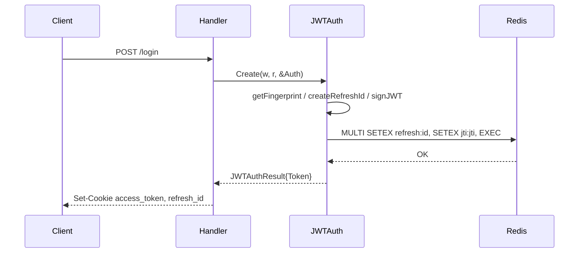
```mermaid
sequenceDiagram
    participant C as Client
    participant H as Handler
    participant J as JWTAuth
    participant R as Redis
    C->>H: POST /login
    H->>J: Create(w, r, &Auth)
    J->>J: getFingerprint / createRefreshId / signJWT
    J->>R: MULTI SETEX refresh:id, SETEX jti:jti, EXEC
    R-->>J: OK
    J-->>H: JWTAuthResult{Token}
    H-->>C: Set-Cookie access_token, refresh_id
```

### Verification with Transparent Refresh

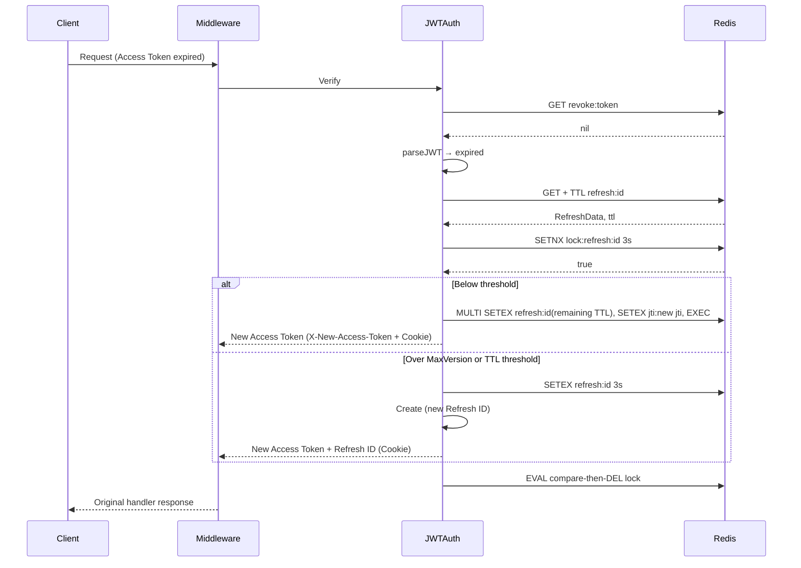
```mermaid
sequenceDiagram
    participant C as Client
    participant M as Middleware
    participant J as JWTAuth
    participant R as Redis
    C->>M: Request (Access Token expired)
    M->>J: Verify
    J->>R: GET revoke:token
    R-->>J: nil
    J->>J: parseJWT → expired
    J->>R: GET + TTL refresh:id
    R-->>J: RefreshData, ttl
    J->>R: SETNX lock:refresh:id 3s
    R-->>J: true
    alt Below threshold
        J->>R: MULTI SETEX refresh:id(remaining TTL), SETEX jti:new jti, EXEC
        J-->>M: New Access Token (X-New-Access-Token + Cookie)
    else Over MaxVersion or TTL threshold
        J->>R: SETEX refresh:id 3s
        J->>J: Create (new Refresh ID)
        J-->>M: New Access Token + Refresh ID (Cookie)
    end
    J->>R: EVAL compare-then-DEL lock
    M-->>C: Original handler response
```

### Logout

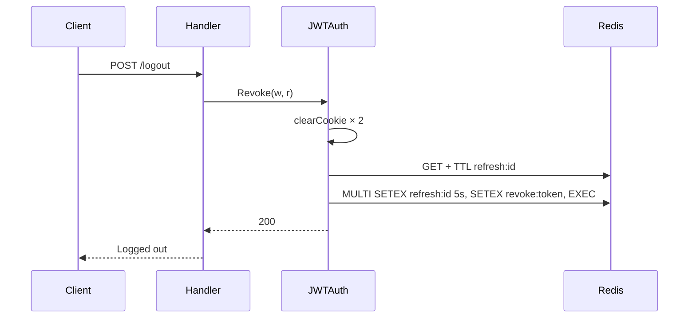
```mermaid
sequenceDiagram
    participant C as Client
    participant H as Handler
    participant J as JWTAuth
    participant R as Redis
    C->>H: POST /logout
    H->>J: Revoke(w, r)
    J->>J: clearCookie × 2
    J->>R: GET + TTL refresh:id
    J->>R: MULTI SETEX refresh:id 5s, SETEX revoke:token, EXEC
    J-->>H: 200
    H-->>C: Logged out
```

## State Machine

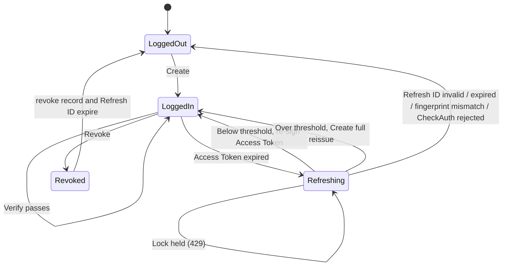
```mermaid
stateDiagram-v2
    [*] --> LoggedOut
    LoggedOut --> LoggedIn: Create
    LoggedIn --> LoggedIn: Verify passes
    LoggedIn --> Refreshing: Access Token expired
    Refreshing --> LoggedIn: Below threshold, re-sign Access Token
    Refreshing --> LoggedIn: Over threshold, Create full reissue
    Refreshing --> LoggedOut: Refresh ID invalid / expired / fingerprint mismatch / CheckAuth rejected
    Refreshing --> Refreshing: Lock held (429)
    LoggedIn --> Revoked: Revoke
    Revoked --> LoggedOut: revoke record and Refresh ID expire
```

***

©️ 2025 [邱敬幃 Pardn Chiu](https://www.linkedin.com/in/pardnchiu)
