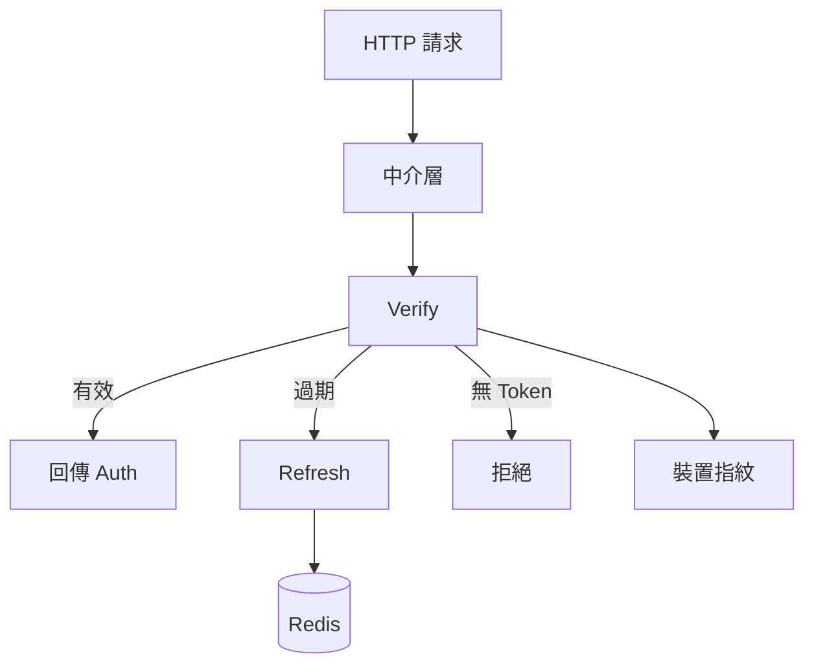
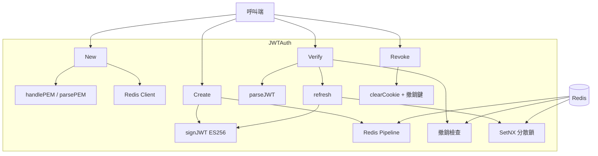
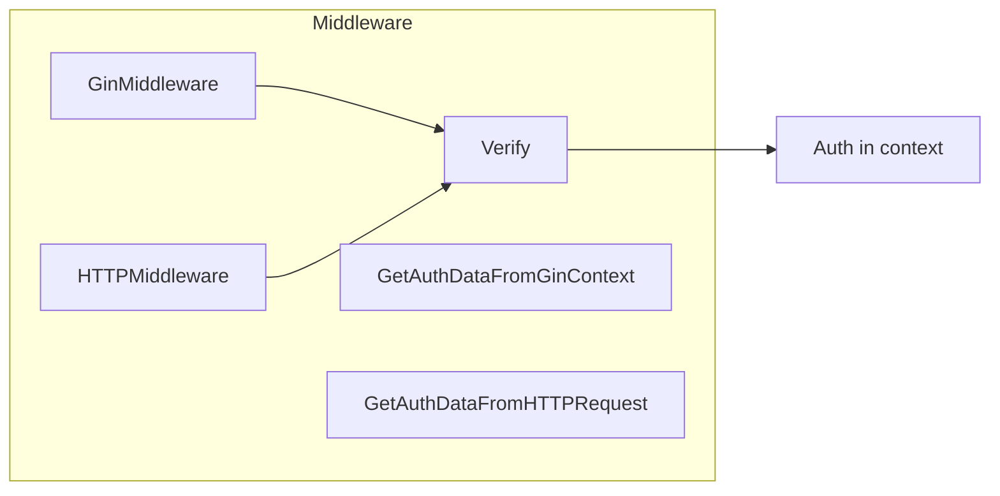
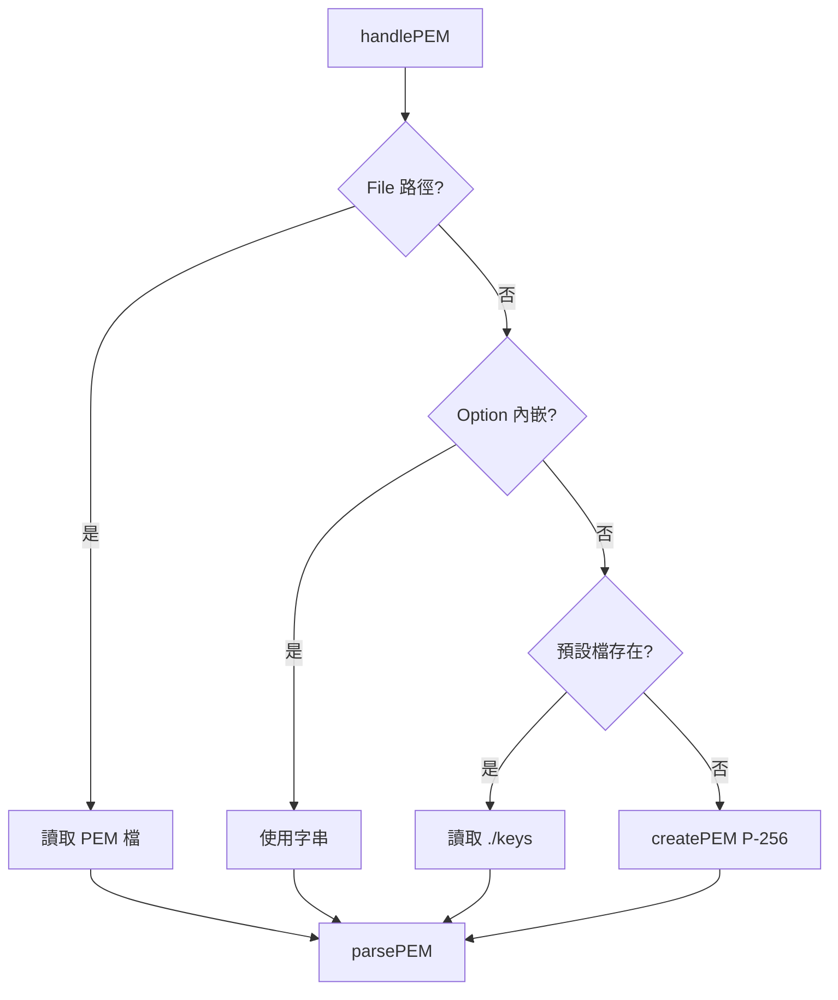
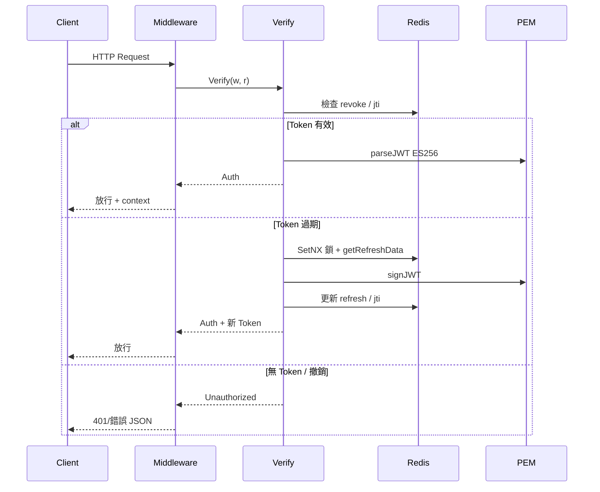

# go-jwt - 架構

> 返回 [README](./README.zh.md)

## 概覽

## Module: JWTAuth

`JWTAuth` 是對外主入口，持有 Config、Redis client 與 ECDSA 金鑰。

## Module: Middleware

Gin 與 net/http 中介層包裝 `Verify`，成功後將 `Auth` 寫入 context。

## Module: PEM

金鑰載入優先序：檔案路徑 → 內嵌 PEM 字串 → 預設路徑自動產生 ECDSA P-256。

## 資料流

***

©️ 2025 [邱敬幃 Pardn Chiu](https://www.linkedin.com/in/pardnchiu)
