# go-jwt - 架構

最後更新：2026-10-04

> 返回 [README](./README.zh.md)

## 概覽

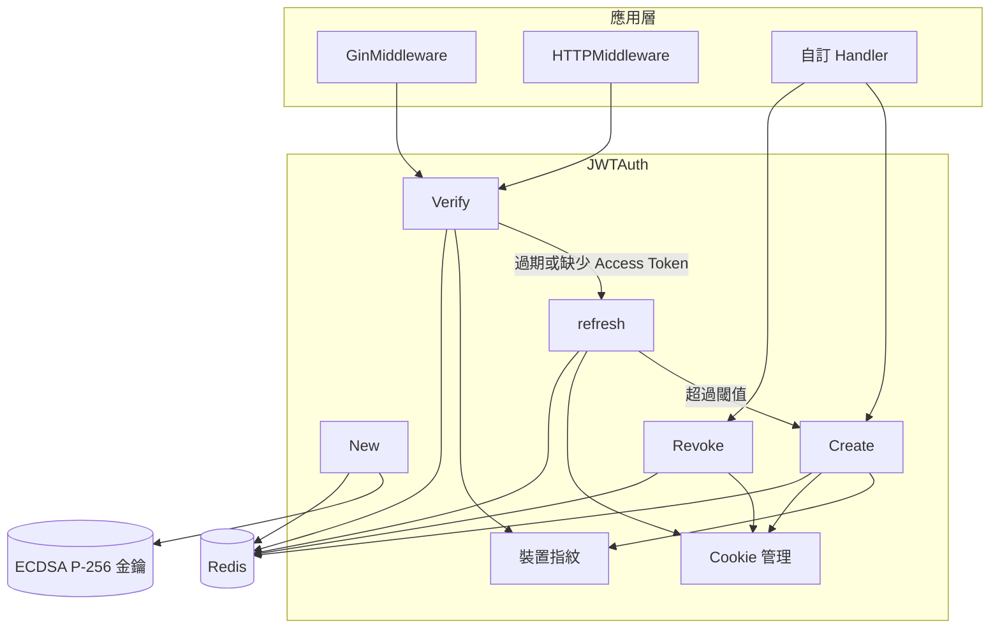
```mermaid
graph TB
    subgraph 應用層
        GIN[GinMiddleware]
        HTTP[HTTPMiddleware]
        APP[自訂 Handler]
    end

    subgraph JWTAuth
        NEW[New]
        CREATE[Create]
        VERIFY[Verify]
        REFRESH[refresh]
        REVOKE[Revoke]
        FP[裝置指紋]
        COOKIE[Cookie 管理]
    end

    GIN --> VERIFY
    HTTP --> VERIFY
    APP --> CREATE
    APP --> REVOKE
    VERIFY -->|過期或缺少 Access Token| REFRESH
    REFRESH -->|超過閾值| CREATE
    CREATE --> FP
    VERIFY --> FP
    CREATE --> COOKIE
    REFRESH --> COOKIE
    REVOKE --> COOKIE

    NEW --> PEM[(ECDSA P-256 金鑰)]
    NEW --> REDIS[(Redis)]
    CREATE --> REDIS
    VERIFY --> REDIS
    REFRESH --> REDIS
    REVOKE --> REDIS
```

## Module: 初始化（New）

套用預設參數、載入或產生 ECDSA 金鑰、建立 Redis 連線與 logger。

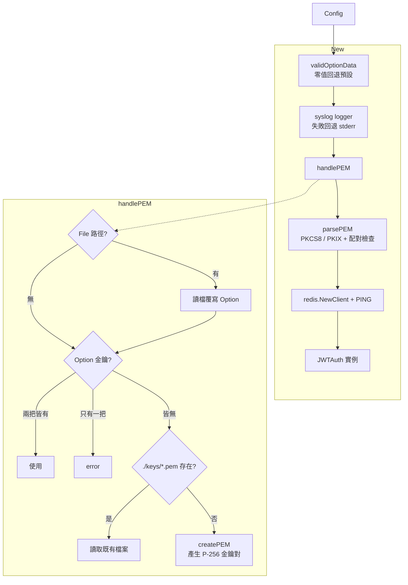
```mermaid
graph TB
    subgraph New
        OPT[validOptionData<br>零值回退預設] --> LOG[syslog logger<br>失敗回退 stderr]
        LOG --> HP[handlePEM]
        HP --> PP["parsePEM<br>PKCS8 / PKIX + 配對檢查"]
        PP --> RC[redis.NewClient + PING]
        RC --> INST[JWTAuth 實例]
    end

    subgraph handlePEM
        F{File 路徑?} -->|有| RF[讀檔覆寫 Option]
        F -->|無| O{Option 金鑰?}
        RF --> O
        O -->|兩把皆有| DONE[使用]
        O -->|只有一把| ERR[error]
        O -->|皆無| D{./keys/*.pem 存在?}
        D -->|是| RD[讀取既有檔案]
        D -->|否| GEN[createPEM<br>產生 P-256 金鑰對]
    end

    CFG[Config] --> OPT
    HP -.-> F
```

## Module: 簽發（Create）

為使用者產生 JTI、Refresh ID 與 ES256 Access Token，並以單一 Transaction 寫入 Redis。

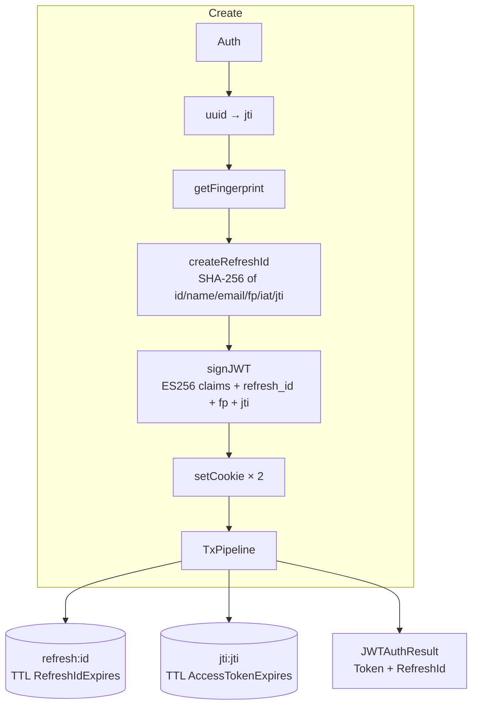
```mermaid
graph TB
    subgraph Create
        IN[Auth] --> JTI[uuid → jti]
        JTI --> FPC[getFingerprint]
        FPC --> RID[createRefreshId<br>SHA-256 of id/name/email/fp/iat/jti]
        RID --> SIGN[signJWT<br>ES256 claims + refresh_id + fp + jti]
        SIGN --> CK[setCookie × 2]
        CK --> TX[TxPipeline]
    end

    TX --> K1[(refresh:id<br>TTL RefreshIdExpires)]
    TX --> K2[(jti:jti<br>TTL AccessTokenExpires)]
    TX --> OUT[JWTAuthResult<br>Token + RefreshId]
```

## Module: 驗證（Verify）

依序檢查撤銷紀錄、簽章與時間、Refresh ID 綁定、指紋與 JTI 白名單。

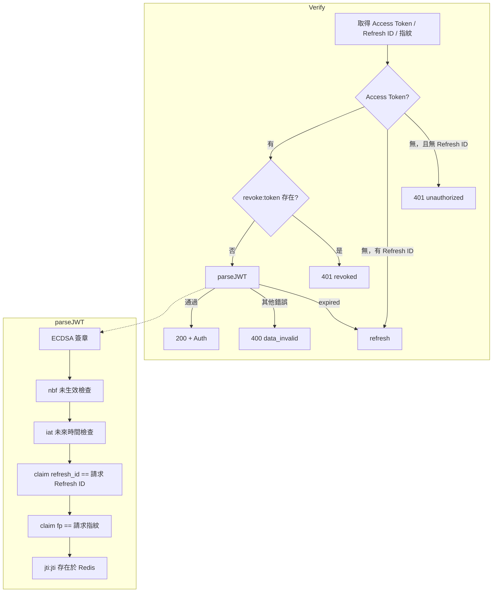
```mermaid
graph TB
    subgraph Verify
        GET[取得 Access Token / Refresh ID / 指紋] --> A{Access Token?}
        A -->|無，且無 Refresh ID| U401[401 unauthorized]
        A -->|無，有 Refresh ID| RF[refresh]
        A -->|有| RV{revoke:token 存在?}
        RV -->|是| R401[401 revoked]
        RV -->|否| PJ[parseJWT]
        PJ -->|expired| RF
        PJ -->|其他錯誤| I400[400 data_invalid]
        PJ -->|通過| OK[200 + Auth]
    end

    subgraph parseJWT
        S[ECDSA 簽章] --> NBF[nbf 未生效檢查]
        NBF --> IAT[iat 未來時間檢查]
        IAT --> RIDM[claim refresh_id == 請求 Refresh ID]
        RIDM --> FPM[claim fp == 請求指紋]
        FPM --> JT[jti:jti 存在於 Redis]
    end

    PJ -.-> S
```

## Module: 刷新（refresh）

以 Refresh ID 取回刷新資料，在分散鎖保護下決定僅重簽 Access Token 或整組重發。

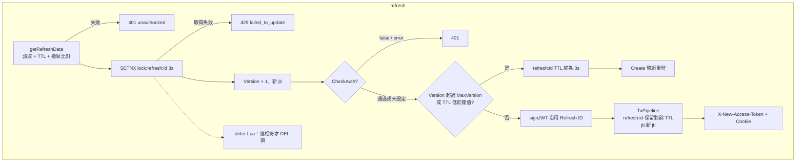
```mermaid
graph TB
    subgraph refresh
        GRD[getRefreshData<br>讀取 + TTL + 指紋比對] -->|失敗| E401[401 unauthorized]
        GRD --> LOCK[SETNX lock:refresh:id 3s]
        LOCK -->|取得失敗| E429[429 failed_to_update]
        LOCK --> VER[Version + 1，新 jti]
        VER --> CA{CheckAuth?}
        CA -->|false / error| C401[401]
        CA -->|通過或未設定| TH{"Version 超過 MaxVersion<br>或 TTL 低於閾值?"}
        TH -->|是| SHORT[refresh:id TTL 縮為 3s] --> CR[Create 整組重發]
        TH -->|否| RS[signJWT 沿用 Refresh ID]
        RS --> TX[TxPipeline<br>refresh:id 保留剩餘 TTL<br>jti:新 jti]
        TX --> HDR[X-New-Access-Token + Cookie]
        UNLOCK[defer Lua：值相符才 DEL 鎖]
    end

    LOCK -.-> UNLOCK
```

## Module: 撤銷（Revoke）

清除 Cookie，並將 Access Token 寫入撤銷紀錄、讓 Refresh ID 於 5 秒後失效。

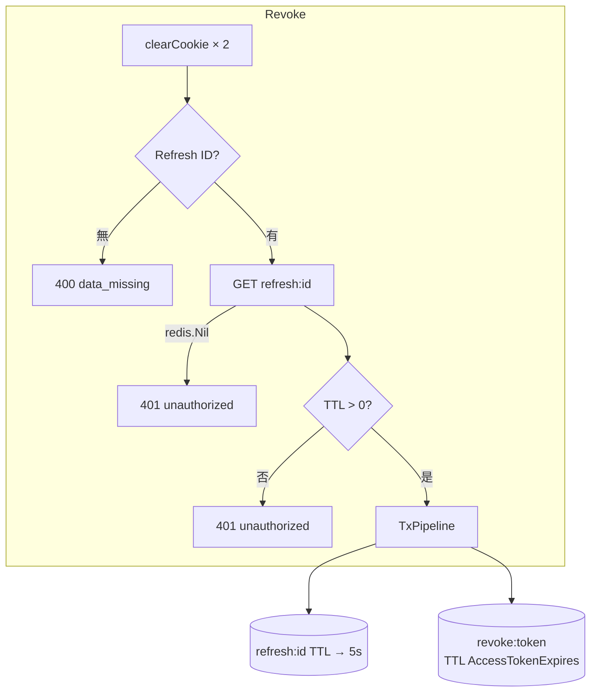
```mermaid
graph TB
    subgraph Revoke
        CC[clearCookie × 2] --> RID{Refresh ID?}
        RID -->|無| E400[400 data_missing]
        RID -->|有| G[GET refresh:id]
        G -->|redis.Nil| E401[401 unauthorized]
        G --> TTL{TTL > 0?}
        TTL -->|否| X401[401 unauthorized]
        TTL -->|是| TX[TxPipeline]
    end

    TX --> K1[(refresh:id TTL → 5s)]
    TX --> K2[(revoke:token<br>TTL AccessTokenExpires)]
```

## Module: 裝置指紋

由 User-Agent 與裝置 ID 推算 SHA-256 指紋；`X-Device-FP` 可直接覆寫。

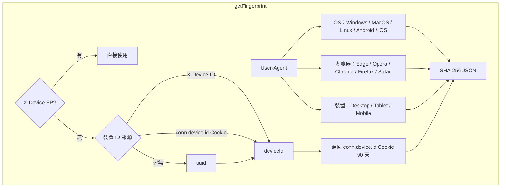
```mermaid
graph TB
    subgraph getFingerprint
        H{X-Device-FP?} -->|有| RET[直接使用]
        H -->|無| DID{裝置 ID 來源}
        DID -->|X-Device-ID| D[deviceId]
        DID -->|conn.device.id Cookie| D
        DID -->|皆無| NEW[uuid]
        NEW --> D
        D --> SC[寫回 conn.device.id Cookie 90 天]
        UA[User-Agent] --> OS[OS：Windows / MacOS / Linux / Android / iOS]
        UA --> BR[瀏覽器：Edge / Opera / Chrome / Firefox / Safari]
        UA --> DEV[裝置：Desktop / Tablet / Mobile]
        OS --> HASH[SHA-256 JSON]
        BR --> HASH
        DEV --> HASH
        SC --> HASH
    end
```

User-Agent 無法對應到任何 OS 或瀏覽器時，該欄位為每次請求隨機產生的 UUID，指紋因此不穩定；非瀏覽器客戶端應帶 `X-Device-FP`。

## Module: 中介層

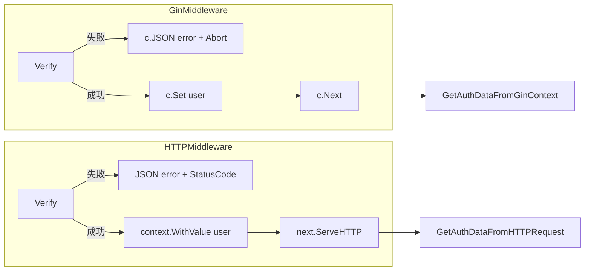
```mermaid
graph LR
    subgraph GinMiddleware
        GV[Verify] -->|失敗| GA[c.JSON error + Abort]
        GV -->|成功| GS[c.Set user] --> GN[c.Next]
    end

    subgraph HTTPMiddleware
        HV[Verify] -->|失敗| HE[JSON error + StatusCode]
        HV -->|成功| HC[context.WithValue user] --> HN[next.ServeHTTP]
    end

    GN --> GG[GetAuthDataFromGinContext]
    HN --> HG[GetAuthDataFromHTTPRequest]
```

## 型別關係

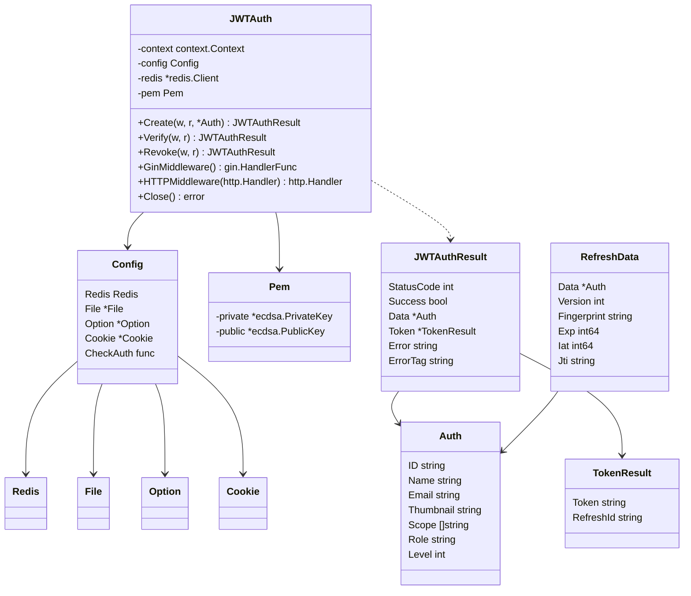
```mermaid
classDiagram
    class Config {
        Redis Redis
        File *File
        Option *Option
        Cookie *Cookie
        CheckAuth func
    }
    class JWTAuth {
        -context context.Context
        -config Config
        -redis *redis.Client
        -pem Pem
        +Create(w, r, *Auth) JWTAuthResult
        +Verify(w, r) JWTAuthResult
        +Revoke(w, r) JWTAuthResult
        +GinMiddleware() gin.HandlerFunc
        +HTTPMiddleware(http.Handler) http.Handler
        +Close() error
    }
    class Pem {
        -private *ecdsa.PrivateKey
        -public *ecdsa.PublicKey
    }
    class JWTAuthResult {
        StatusCode int
        Success bool
        Data *Auth
        Token *TokenResult
        Error string
        ErrorTag string
    }
    class TokenResult {
        Token string
        RefreshId string
    }
    class RefreshData {
        Data *Auth
        Version int
        Fingerprint string
        Exp int64
        Iat int64
        Jti string
    }
    class Auth {
        ID string
        Name string
        Email string
        Thumbnail string
        Scope []string
        Role string
        Level int
    }

    JWTAuth --> Config
    JWTAuth --> Pem
    Config --> Redis
    Config --> File
    Config --> Option
    Config --> Cookie
    JWTAuth ..> JWTAuthResult
    JWTAuthResult --> Auth
    JWTAuthResult --> TokenResult
    RefreshData --> Auth
```

## 資料流

### 登入

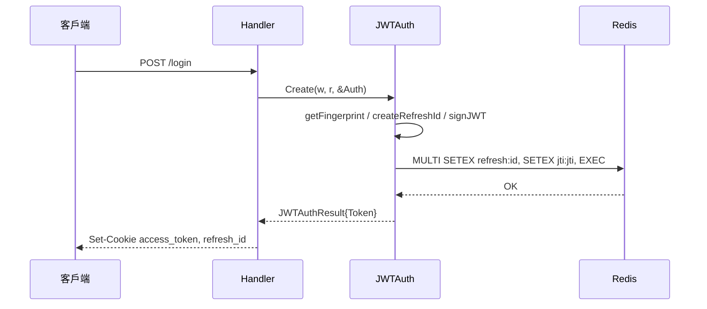
```mermaid
sequenceDiagram
    participant C as 客戶端
    participant H as Handler
    participant J as JWTAuth
    participant R as Redis
    C->>H: POST /login
    H->>J: Create(w, r, &Auth)
    J->>J: getFingerprint / createRefreshId / signJWT
    J->>R: MULTI SETEX refresh:id, SETEX jti:jti, EXEC
    R-->>J: OK
    J-->>H: JWTAuthResult{Token}
    H-->>C: Set-Cookie access_token, refresh_id
```

### 驗證與透明刷新

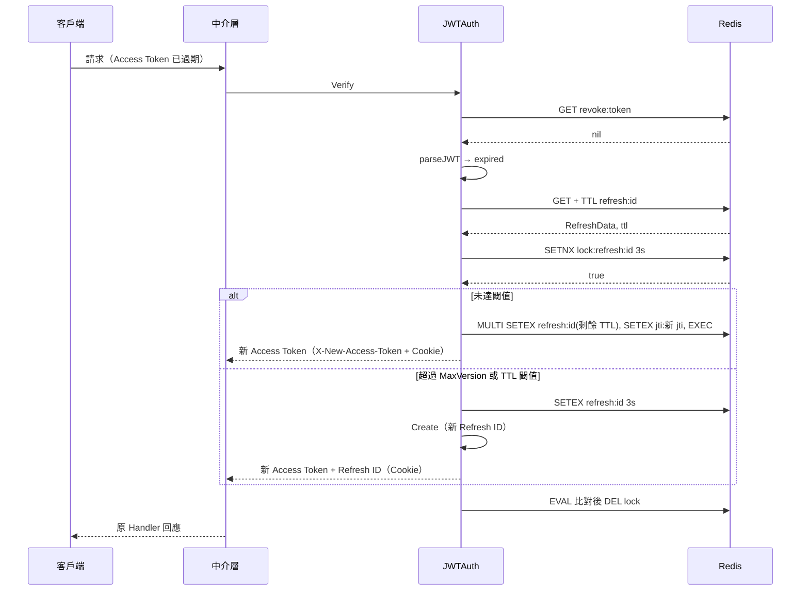
```mermaid
sequenceDiagram
    participant C as 客戶端
    participant M as 中介層
    participant J as JWTAuth
    participant R as Redis
    C->>M: 請求（Access Token 已過期）
    M->>J: Verify
    J->>R: GET revoke:token
    R-->>J: nil
    J->>J: parseJWT → expired
    J->>R: GET + TTL refresh:id
    R-->>J: RefreshData, ttl
    J->>R: SETNX lock:refresh:id 3s
    R-->>J: true
    alt 未達閾值
        J->>R: MULTI SETEX refresh:id(剩餘 TTL), SETEX jti:新 jti, EXEC
        J-->>M: 新 Access Token（X-New-Access-Token + Cookie）
    else 超過 MaxVersion 或 TTL 閾值
        J->>R: SETEX refresh:id 3s
        J->>J: Create（新 Refresh ID）
        J-->>M: 新 Access Token + Refresh ID（Cookie）
    end
    J->>R: EVAL 比對後 DEL lock
    M-->>C: 原 Handler 回應
```

### 登出

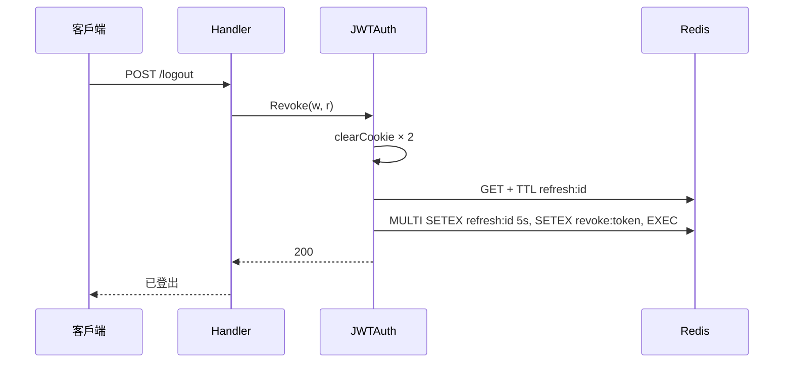
```mermaid
sequenceDiagram
    participant C as 客戶端
    participant H as Handler
    participant J as JWTAuth
    participant R as Redis
    C->>H: POST /logout
    H->>J: Revoke(w, r)
    J->>J: clearCookie × 2
    J->>R: GET + TTL refresh:id
    J->>R: MULTI SETEX refresh:id 5s, SETEX revoke:token, EXEC
    J-->>H: 200
    H-->>C: 已登出
```

## 狀態機

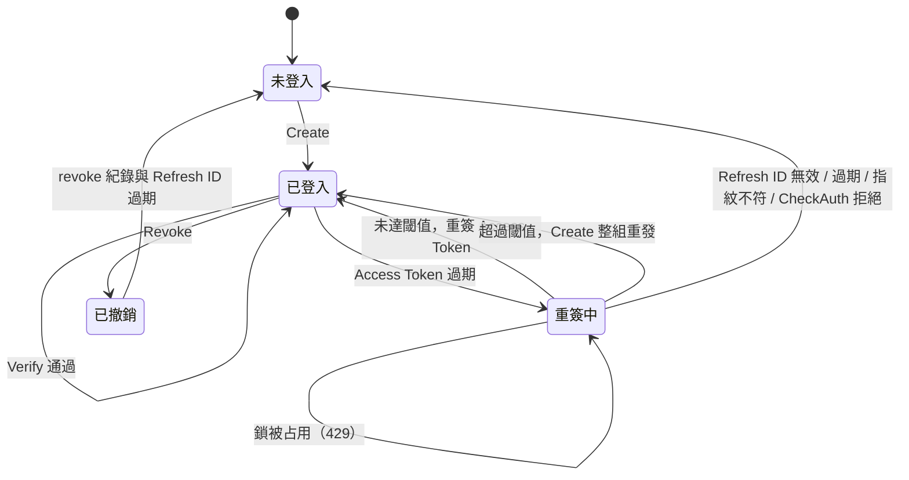
```mermaid
stateDiagram-v2
    [*] --> 未登入
    未登入 --> 已登入: Create
    已登入 --> 已登入: Verify 通過
    已登入 --> 重簽中: Access Token 過期
    重簽中 --> 已登入: 未達閾值，重簽 Access Token
    重簽中 --> 已登入: 超過閾值，Create 整組重發
    重簽中 --> 未登入: Refresh ID 無效 / 過期 / 指紋不符 / CheckAuth 拒絕
    重簽中 --> 重簽中: 鎖被占用（429）
    已登入 --> 已撤銷: Revoke
    已撤銷 --> 未登入: revoke 紀錄與 Refresh ID 過期
```

***

©️ 2025 [邱敬幃 Pardn Chiu](https://www.linkedin.com/in/pardnchiu)
